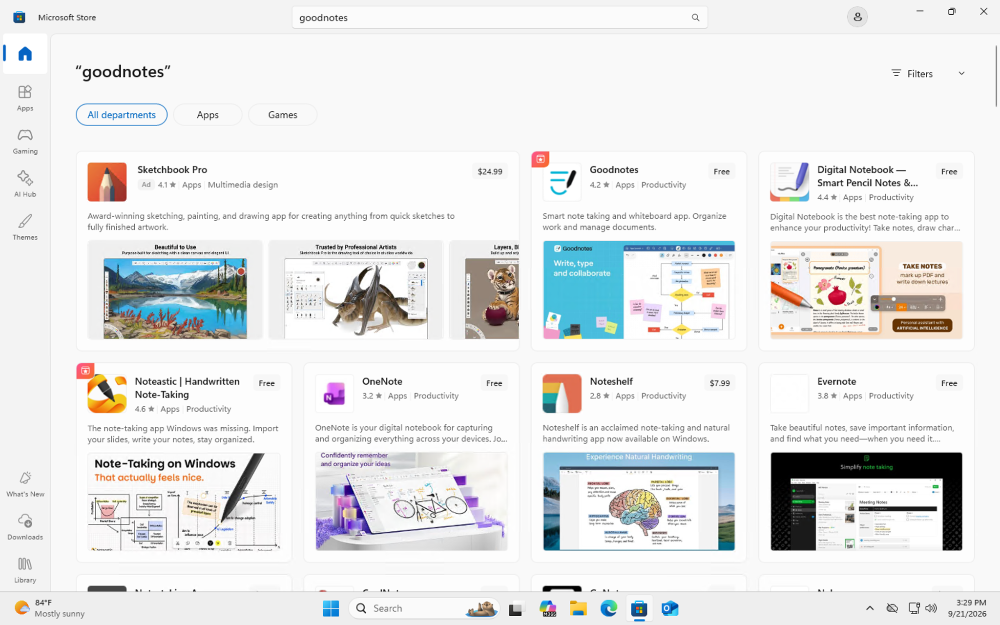
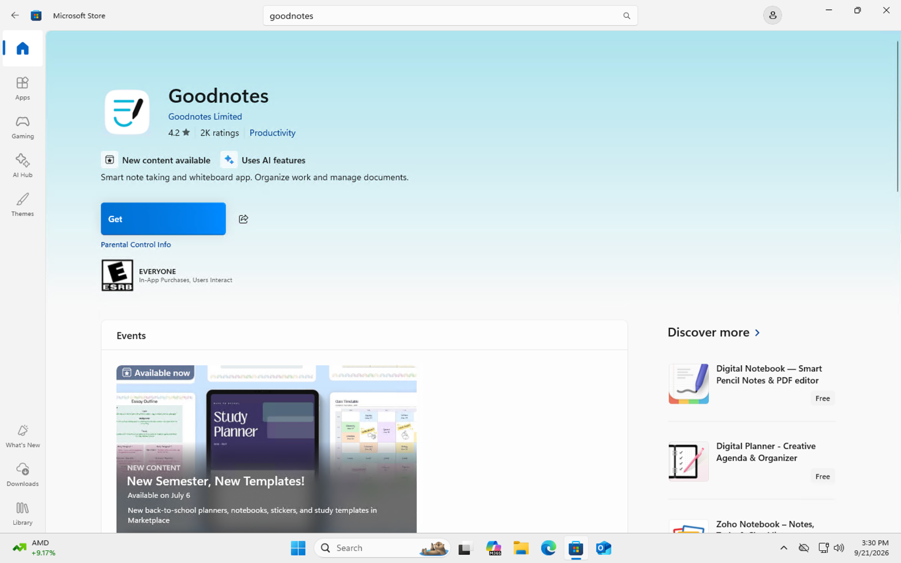
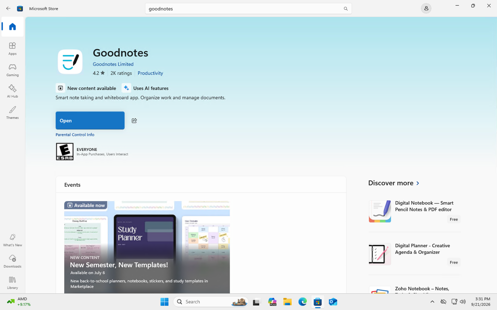
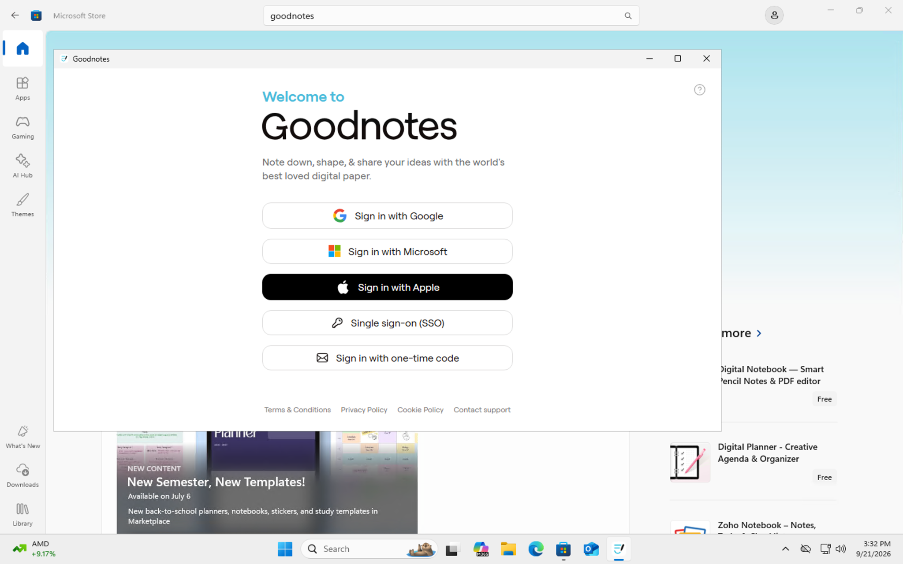

# Software Installation

## Objective
Install and verify an application on a Windows 11 virtual machine using Microsoft Store.

## Step 1: Search for the Application

Opened Microsoft Store and searched for **Goodnotes**.

## Step 2: Review the Application

Opened the Goodnotes application page and confirmed the correct application before installation.

## Step 3: Install the Application

Selected **Get** to install Goodnotes. After installation completed, the button changed to **Open**.

## Step 4: Verify the Installation

Opened Goodnotes and confirmed that the application launched successfully.

## Skills Demonstrated

- Windows 11
- Software Installation
- Microsoft Store
- Application Verification
- Desktop Support
